<br><br>

<!-- project philosophy -->


> A mobile app that optimizes bus routes in Lebanon by organizing the bus's movement, reducing wait times, and improving transportation services. 

### User Stories
- As a new user, I want to be able to register for an account so that I can access the app's features and functionalities.
- As a user, I want to be able to log in to my account using my email and password so that I can access my personalized data.
- As a passenger, I want to be able to search for available trips and reserve a seat on a particular bus, so that I can plan my travel in advance.
- As a passenger, I want to be able to view all my current reserved trips, so that I dont forgot my trips.
- As a passenger, I want to be able to view all my finished trips, so that I have records my trips.
- As a passenger, I want to be able to track the live location of the bus driver, so that I can estimate the arrival time and prepare for my trip.
- As a bus driver, I want to be able to add a trip, so that passengers can reserve.
- As a bus driver, I want to be able to view all my current trips, so that I dont be late.
- As a bus driver, I want to be able to view all my finished trips, so that I have records my trips.
- As an admin, I want to be able to view real-time information about both the users, so that I can monitor the system's performance.
- As an admin, I want to be able to approve registered drivers, so that unofficial driver cant work.
- As an admin, I want to be able to delete users, so that I ensure that the app services are working without problems

<br><br>

<!-- Prototyping -->


> We designed BussBoss using wireframes and mockups, iterating on the design until we reached the ideal layout for easy navigation and a seamless user experience.

### Wireframes
| Login screen  | PreRegister screen |  Passenger Register | Driver Register |
| ---| ---| ---| ---|
| 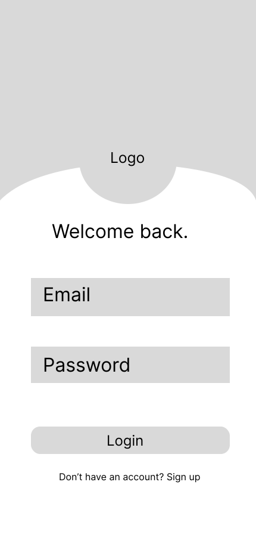 | 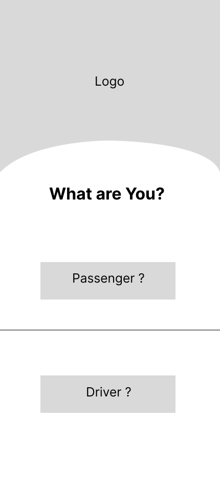 |  | |

| Passenger Main  | Bus Schedule |  Current Trips | All Trips |
| ---| ---| ---| ---|
| 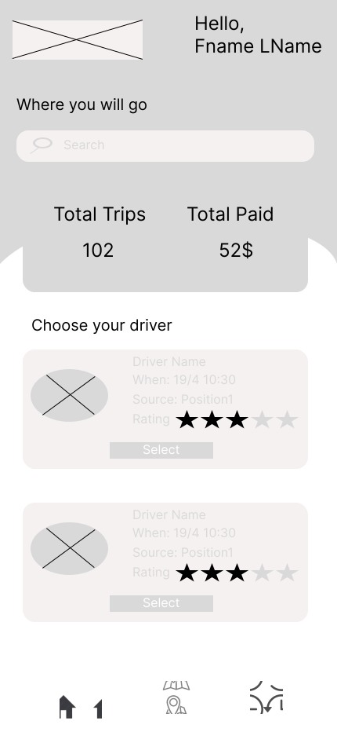 | 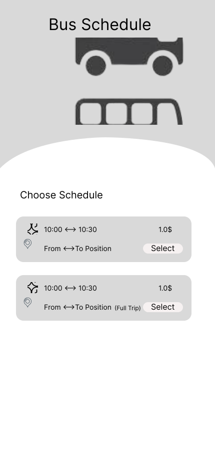 | 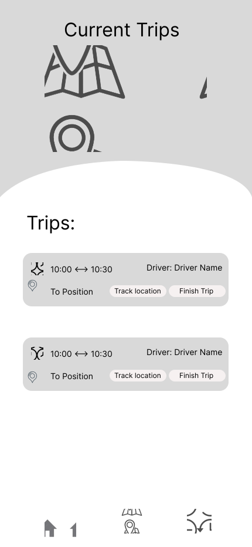 | |

| Driver Main  | Add Trip |  All Trips | 
| ---| ---| ---| 
|  |  |  | 

| Admin Passengers  | Admin Drivers | 
| ---| ---|
|  |  |

### Mockups
| Login screen  | PreRegister screen |  Passenger Register | Driver Register |
| ---| ---| ---| ---|
|  | 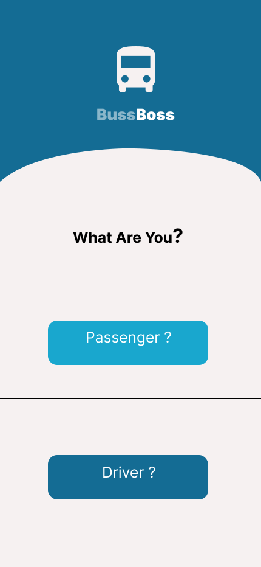 |  | |

| Passenger Main  | Bus Schedule |  Current Trips | All Trips |
| ---| ---| ---| ---|
|  |  |  ||

| Driver Main  | Add Trip |  All Trips | 
| ---| ---| ---| 
| 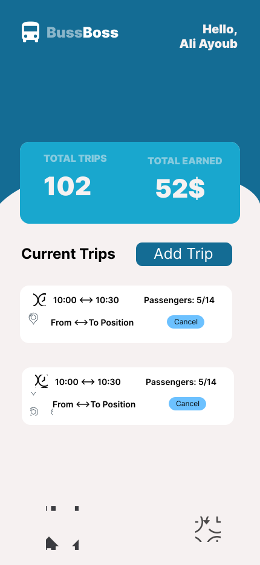 |  |  | 

| Admin Passengers  | Admin Drivers | 
| ---| ---|
|  |  |

<br><br>

<!-- Implementation -->


> Using the wireframes and mockups as a guide, we implemented the BussBoss app with the following features:

### User Screens (Mobile)
| Login screen  | PreRegister screen | Passenger Register | Driver Register |
| ---| ---| ---| ---|
|  | 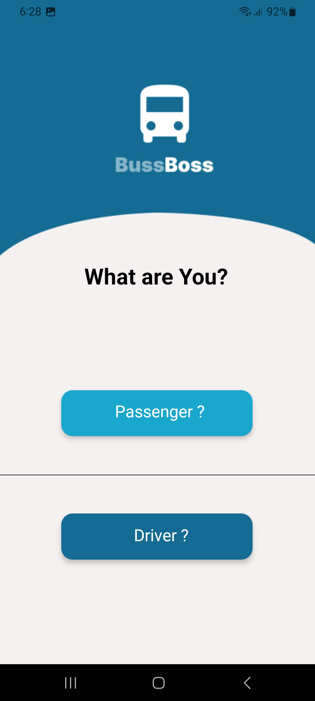 | 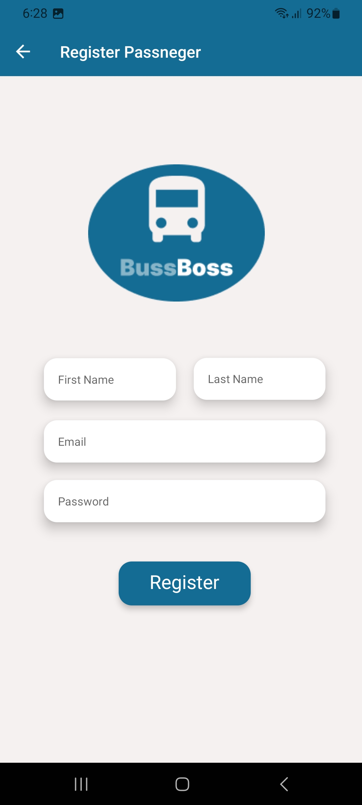 | |
| Passenger Main  | Buss Schedule | Current Trips  | Finish Trip |
|  |  |  | |
| All Trips  | Track Bus | Add Trip  | Driver All Trips |
| 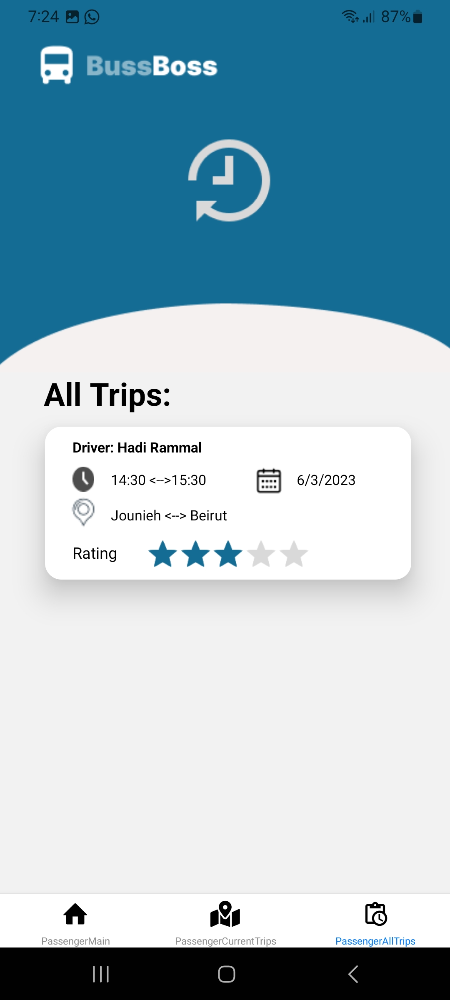 |  |  | |
|Driver Main | 
|  | 

### Admin Screens (Web)
| Login screen  | Passengers screen |  Drivers screen |
| ---| ---| ---|
| 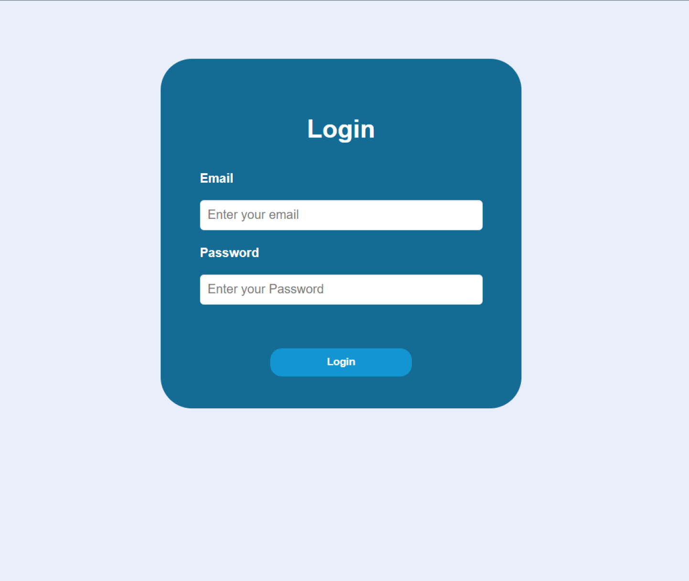 | 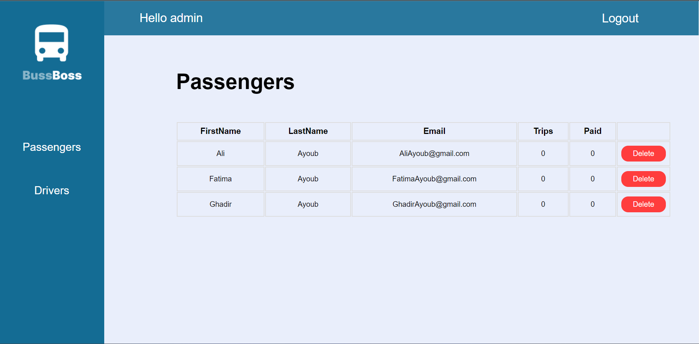 |  |


<br><br>

<!-- Tech stack -->


###  BussBoss is built using the following technologies:

- This project uses the [React Native app development framework](https://reactnative.dev/). React Native is a cross-platform hybrid app development platform which allows us to use a single codebase for apps on mobile, desktop, and the web.
- For persistent storage (database), the app uses the [MySQL](https://www.mysql.com/) package which allows the app to create a custom storage and save it to a local database.

<br><br>

<!-- How to run -->


> To set up Coffee Express locally, follow these steps:

### Prerequisites

This is an example of how to list things you need to use the software and how to install them.
* npm
  ```sh
  npm install npm@latest -g
  ```

### Installation

_Below is an example of how you can instruct your audience on installing and setting up your app. This template doesn't rely on any external dependencies or services._

1. Get a free API Key at [https://example.com](https://example.com)
2. Clone the repo
   ```sh
   git clone https://github.com/your_username_/Project-Name.git
   ```
3. Install NPM packages
   ```sh
   npm install
   ```
4. Enter your API in `config.js`
   ```js
   const API_KEY = 'ENTER YOUR API';
   ```

Now, you should be able to run Coffee Express locally and explore its features.
