<br><br>

<!-- project philosophy -->


> A mobile app that optimizes bus routes in Lebanon by organizing the bus's movement, reducing wait times, and improving transportation services.

## User Stories

### Passenger:

- As a passenger, I want to be able to search for available trips and reserve a seat on a particular bus, so that I can plan my travel in advance.
- As a passenger, I want to be able to view all my currently reserved trips, so that I don't forget about them.
- As a passenger, I want to be able to view all my finished trips, so that I have a record of my travel history.
- As a passenger, I want to be able to track the live location of the bus driver, so that I can estimate the arrival time and prepare for my trip.

### Driver:

- As a bus driver, I want to be able to add a trip, so that passengers can make reservations.
- As a bus driver, I want to be able to view all my current trips, so that I can manage my schedule effectively.
- As a bus driver, I want to be able to view all my finished trips, so that I have a record of my completed journeys.

### Admin:

- As an admin, I want to be able to view real-time information about both the users, so that I can monitor the system's performance.
- As an admin, I want to be able to approve registered drivers, so that only authorized drivers can provide their services.
- As an admin, I want to be able to delete users, so that I can ensure the smooth functioning of the app's services.

<br><br>

<!-- Prototyping -->


> We designed BussBoss using wireframes and mockups, iterating on the design until we reached the ideal layout for easy navigation and a seamless user experience.

### Wireframes

| Login screen                              | PreRegister screen                            | Passenger Register                                  | Driver Register                                  |
| ----------------------------------------- | --------------------------------------------- | --------------------------------------------------- | ------------------------------------------------ |
|  |  |  |  |

| Passenger Main                                    | Bus Schedule                                  | Current Trips                                  | All Trips                                  |
| ------------------------------------------------- | --------------------------------------------- | ---------------------------------------------- | ------------------------------------------ |
|  |  |  | 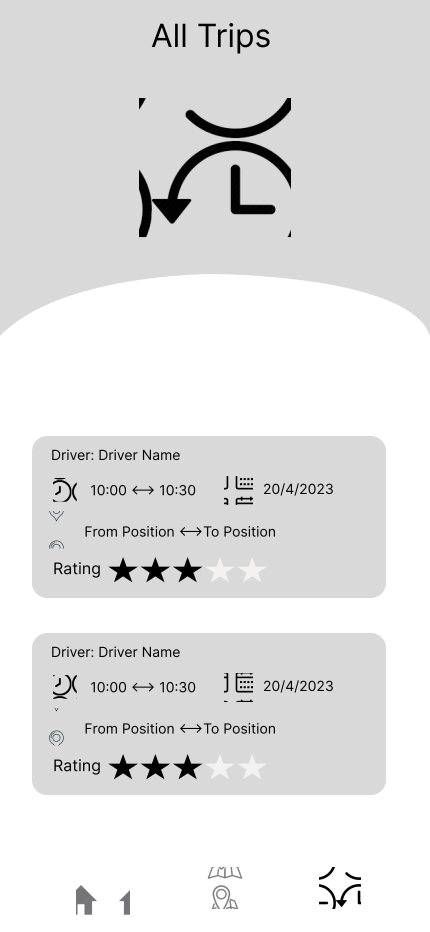 |

| Driver Main                                    | Add Trip                                  | All Trips                                        |
| ---------------------------------------------- | ----------------------------------------- | ------------------------------------------------ |
|  |  |  |

| Admin Passengers                                     | Admin Drivers                                   |
| ---------------------------------------------------- | ----------------------------------------------- |
|  | 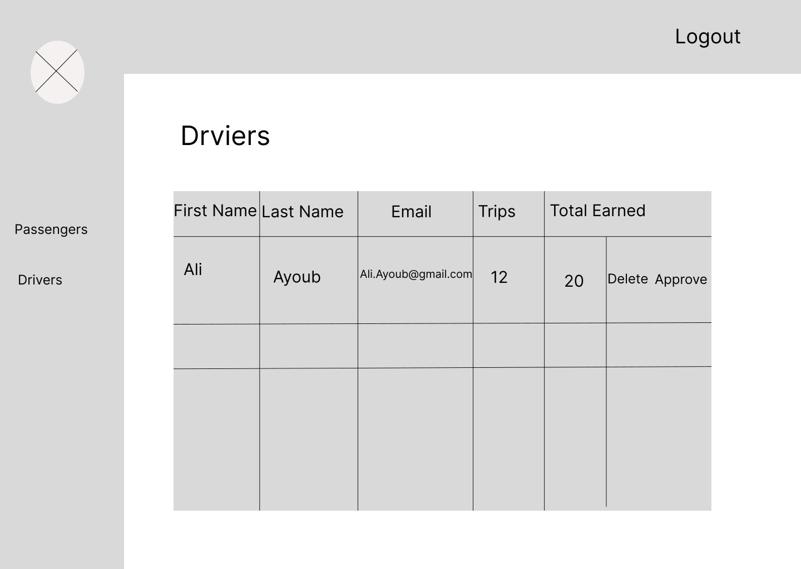 |

### Mockups

| Login screen                           | PreRegister screen                         | Passenger Register                               | Driver Register                               |
| -------------------------------------- | ------------------------------------------ | ------------------------------------------------ | --------------------------------------------- |
| 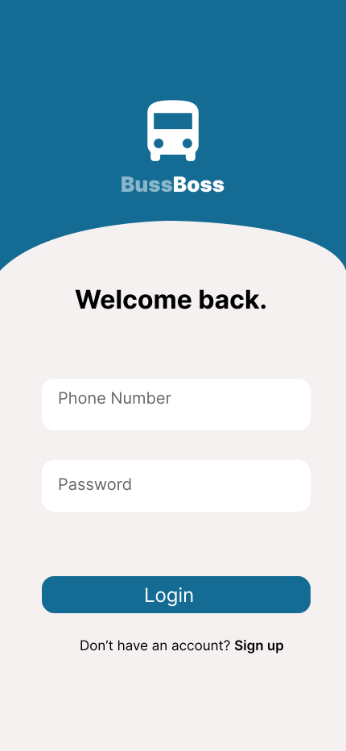 |  |  | 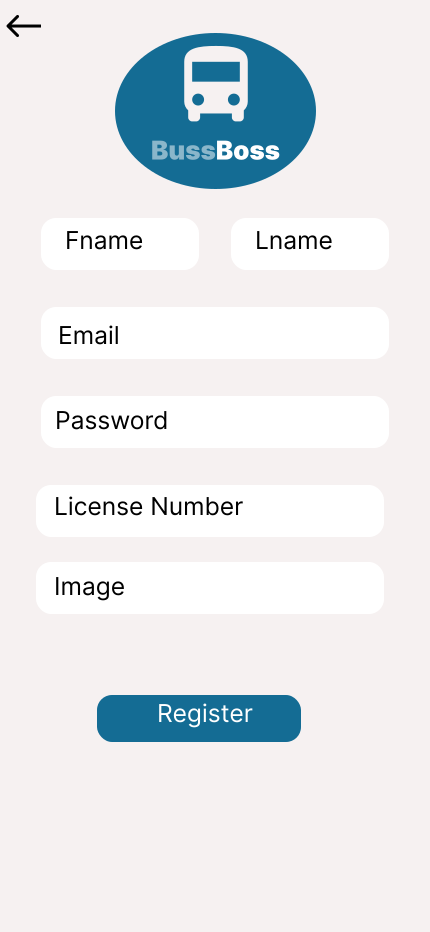 |

| Passenger Main                                 | Bus Schedule                                | Current Trips                               | All Trips                               |
| ---------------------------------------------- | ------------------------------------------- | ------------------------------------------- | --------------------------------------- |
| 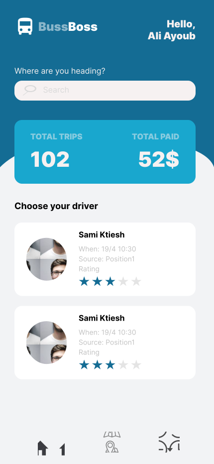 |  |  |  |

| Driver Main                                 | Add Trip                               | All Trips                                     |
| ------------------------------------------- | -------------------------------------- | --------------------------------------------- |
|  |  |  |

| Admin Passengers                                 | Admin Drivers                              |
| ------------------------------------------------ | ------------------------------------------ |
| 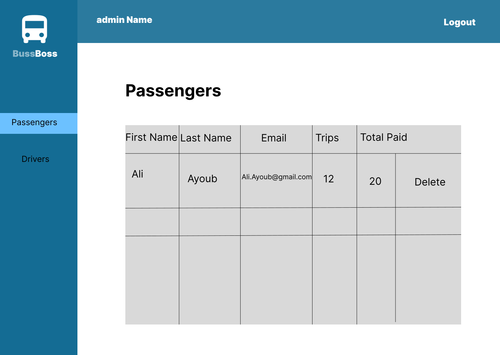 |  |

<br><br>

<!-- Implementation -->


> Using the wireframes and mockups as a guide, we implemented the BussBoss app with the following features:

### User Screens (Mobile)

| Login screen                                   | PreRegister screen                         | Passenger Register                               | Driver Register                               |
| ---------------------------------------------- | ------------------------------------------ | ------------------------------------------------ | --------------------------------------------- |
| 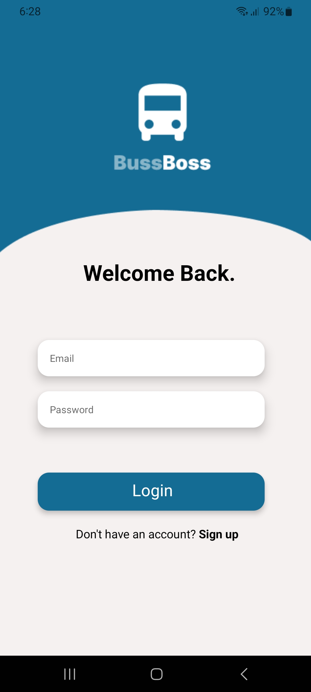         |  |  |  |
| Passenger Main                                 | Buss Schedule                              | Current Trips                                    | Finish Trip                                   |
|  |  |       | 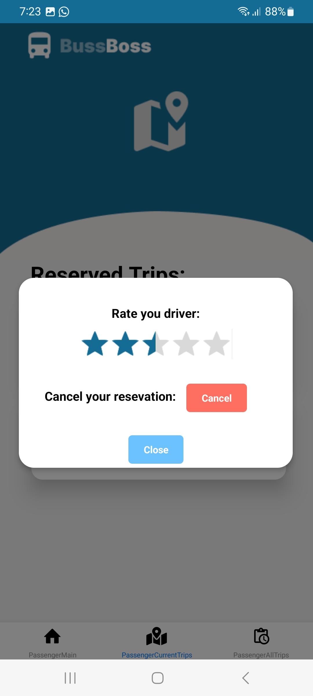     |
| All Trips                                      | Track Bus                                  | Add Trip                                         | Driver All Trips                              |
|       | 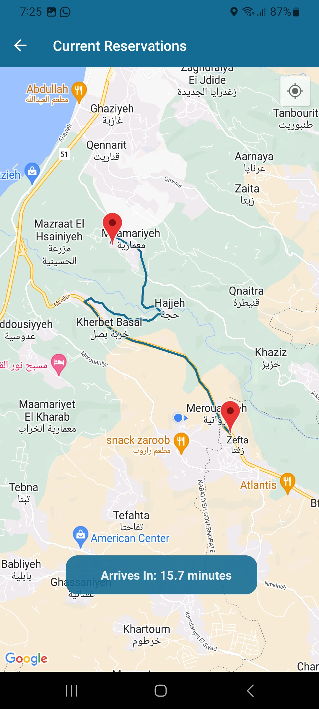         |            | 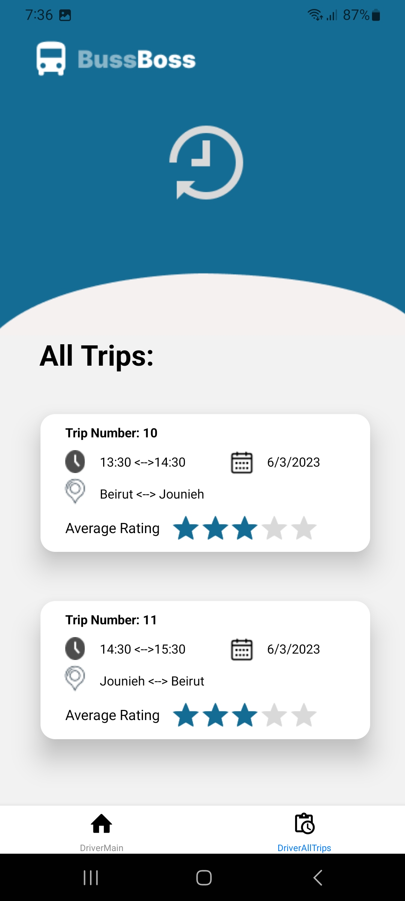  |
| Driver Main                                    | Search                                     | Reserve Trip                                     | Finsih Trip                                   |
| 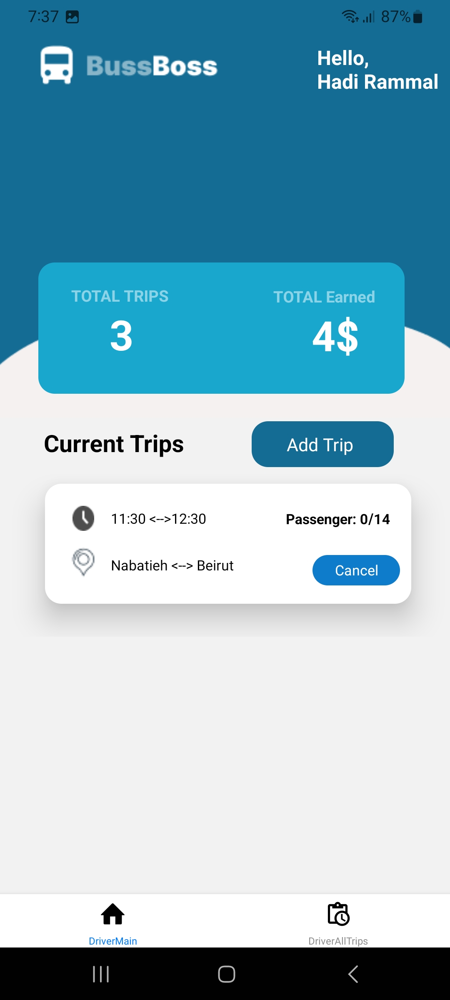    | 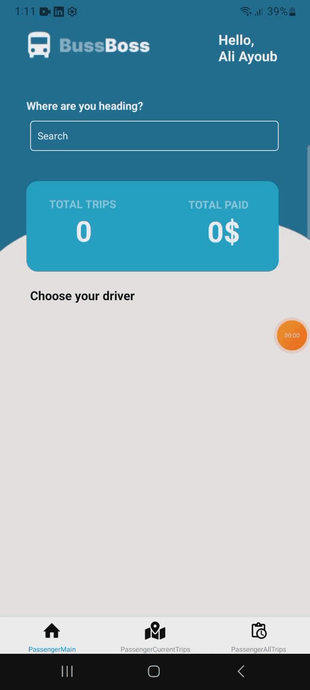   | 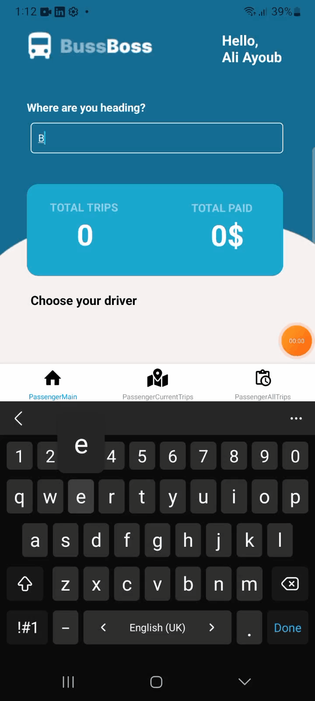         | 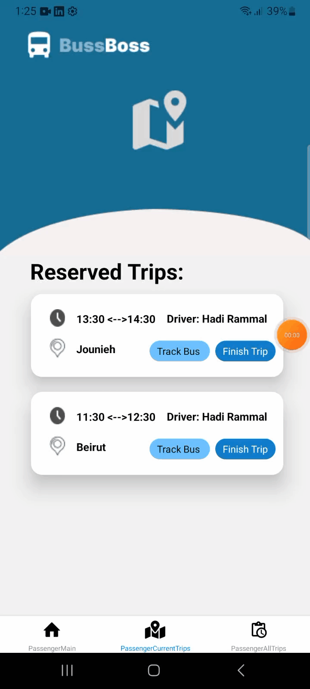      |
| Track Driver                                   |
| 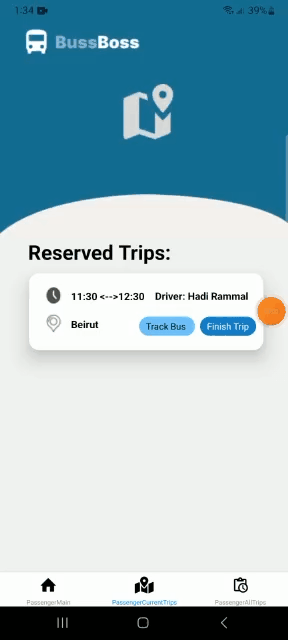       |

### Admin Screens (Web)

| Login screen                            | Passengers screen                     | Drivers screen                        |
| --------------------------------------- | ------------------------------------- | ------------------------------------- |
|  |  |  |

<br><br>

<!-- Tech stack -->


### BussBoss is built using the following technologies:

- This project uses the [React Native app development framework](https://reactnative.dev/). React Native is a cross-platform hybrid app development platform which allows us to use a single codebase for apps on mobile, desktop, and the web.
- For persistent storage (database), the app uses the [MySQL](https://www.mysql.com/) package which allows the app to create a custom storage and save it to a local database.

<br><br>

<!-- How to run -->


> To set up BussBoss locally, follow these steps:

### Prerequisites

- Install NPM from: [NPM](https://nodejs.org/en/download)

- Install composer from: [Composer](https://getcomposer.org/download)

- Database server: Any Apache HTTP Server, MariaDB database server, recommended [XAMPP](https://www.apachefriends.org)
  This is an example of how to list things you need to use the software and how to install them.

## Installation

### First, Cloning and Installing Packages

_Below are the steps to follow to run the project_

1. Clone the repo
   ```sh
   git clone https://github.com/Ali-Ayb/BussBoss.git
   ```
2. Install NPM packages for admin by opening terminal in `BussBoss-desktop` and run
   ```sh
   npm install
   ```
3. Install NPM packages for user react native by opening terminal in `BussBoss-mobile` and run
   ```sh
   npm install
   ```
4. Install Composer packages for server by opening terminal in `BussBoss-server` and run
   ```sh
   composer install
   ```
   Or if error occurs
   ```sh
   composer update
   ```

### Second, let's start the server

In `BussBoss-server`:

1. Copy `.env.example` file and rename it `.env` you can run
   ```sh
   cp .env.example .env
   ```
2. Open your `.env` file and change the database name (DB_DATABASE) to whatever you need or to `bussboss_db`, username (DB_USERNAME) and password (DB_PASSWORD) field correspond to your configuration if you configured them.

3. Run the following command for larval ,JWT and Data Base (you must have your XAMPP server running)

   ```sh
      php artisan key:generate
   ```

   ```sh
      php artisan jwt:secret
   ```

   ```sh
      php artisan migrate
   ```

   ```sh
      php artisan storage:link
   ```

   ```sh
      php artisan serve --host <YOUR_LOCAL_IPv4@> --port 8000
   ```

   you can get your IPV4@ by running

   on windows

   ```sh
      ipconfig
   ```

   on linux

   ```sh
      ifconfig
   ```

### Now the Admin part

Go to `BussBoss-desktop`:

1. IN `\src\hooks\http-hook.js` change IP to you IPV4@ or server IP@

   ```js
   URL = "SERVER_IP@/api/ony";
   ```

2. In The Terminal Run

   ```sh
     npm start
   ```

   ### Finally for User Application

In `BussBoss-mobile` :

1. Copy "or Create" `.env.example` file and rename it `.env` you can run
   ```sh
   cp .env.example .env
   ```
2. Add Server IP@ /Link
   ```js
      BASE_URL=<SERVER_IP>/api/ony
   ```
3. Add Your API Google Maps Key, You can follow [Maps JavaScript API](https://developers.google.com/maps/documentation/javascript/get-api-key) to learn how to get one

   ```js
      GOOGLE_MAPS_APIKEY=<YOUR_KEY>
   ```

4. In `\hooks\request.js` change IP to you IPV4@ or server IP@

   ```js
   const URL = "SERVER_IP@/api/ony";
   ```

5. In The Terminal Run

   ```sh
     npx expo start
   ```

   <br>

Congratulations, The App Must be Working Now.

<br> <br>

Some Installation may be different on different OS.
The app was never tested on an ios devices .

<br> <br>

Enjoy your tour and please provide me with feedback. 🎉
